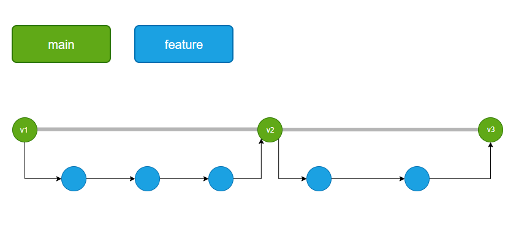

Esse documento descreve nosso atual fluxo de branches e esteira de entrega no Github.



## Fluxo de Branches

Seguimos um fluxo de branches minimalista para não gerar muita complexidade e overhead. O fluxo é composto por 3 branches principais:

- `main`: branch principal, contém o código em produção
- `feature`: branch de feature, contém o código de uma feature em desenvolvimento
- `bugfix`: branch de hotfix, contém o código de um hotfix em desenvolvimento

### Simulação de fluxo

Imaginando que você esteja prestes a iniciar o desenvolvimento de uma nova feature, você deve criar uma branch de feature a partir da branch `main`:

```bash
git checkout main
git fetch origin
git pull
git checkout -b feature/nome-da-feature
git push -u origin feature/nome-da-feature
```

Durante o desenvolvimento, é importante que você efetue commits periódicos 

```bash
git add .
git commit -m "mensagem do commit"
git push origin feature/nome-da-feature
```

e mantenha a sua branch de feature atualizada com a branch `main`, para garantir que seu código contenha o código mais recente da branch principal:

```bash
git checkout main
git fetch origin
git pull
git checkout feature/nome-da-feature
git rebase origin/main
git push origin feature/nome-da-feature
```

Caso o comando `git rebase origin/main` gere conflitos, você deve resolvê-los e efetuar um novo commit. Caso não saiba resolver os conflitos, **você deve solicitar ajuda de um colega**.

Após finalizar o desenvolvimento da feature, fazer os commits e dar `push` de suas alterações, você deve abrir um Pull Request para a branch `main` e solicitar a revisão de um colega. Após a revisão, o Pull Request deve ser aprovado e a branch `feature/nome-da-feature` será mesclada (merge) à branch `main`.

```bash
git checkout main
git fetch origin 
git pull
git checkout feature/nome-da-feature
git merge main
git push origin feature/nome-da-feature
```
