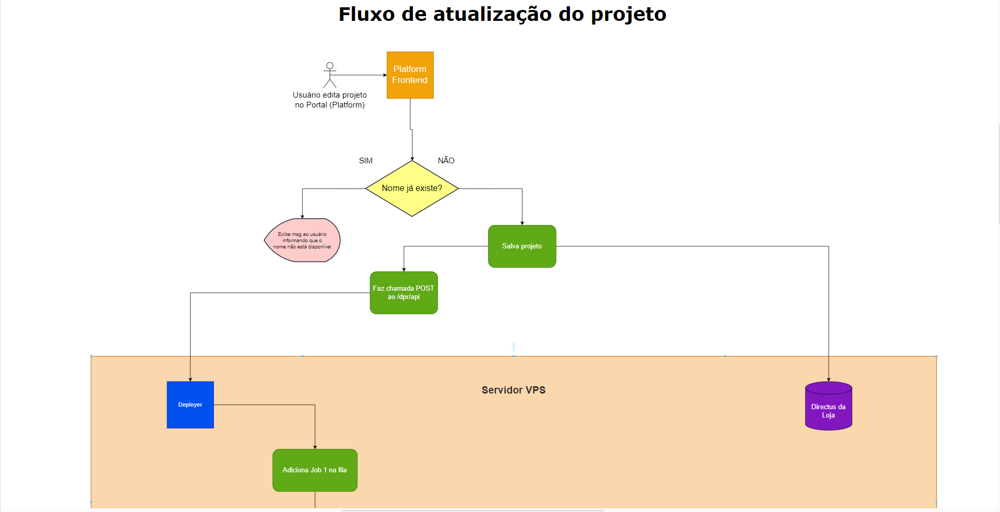
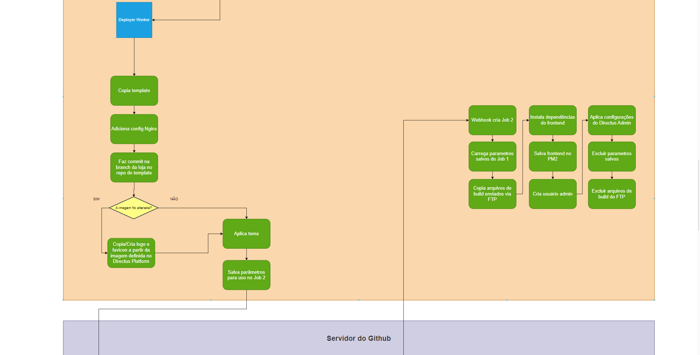
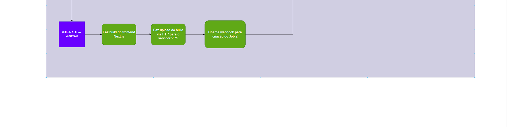

O Deployer é uma API Node.js que é responsável por criar e editar os arquivos de projeto de uma loja virtual, de acordo com as informações fornecidas pelo cliente, através da [Plataforma](/docs/loja_na_net/platform).

----

Repositório: https://github.com/firestormapps/deployer

----

## Fluxograma de criação e edição de um site na Plataforma

[Link para o fluxograma atualizado](https://app.diagrams.net/#G1XamyaEMXRNmi942a64oO-PSrf1Q4tlhG)

:::tip

Solicite acesso à equipe caso não consiga visualizar.

:::

### Explicando o fluxograma

1. O cliente cria uma nova loja virtual na [Plataforma](/docs/loja_na_net/platform)
2. É criada variável `projectUrlPath`, como resultado da função `getKeysStringFromLabel`. Essa variável serve como idenficador único do projeto, e é utilizada para criar o nome da branch no repositório no Github, o nome do projeto no [CMS](/docs/loja_na_net/platform_backend), o nome das pastas dos arquivos do projeto no [Servidor VPS](/docs/infra/vps_settings), etc. Essa função remove qualquer acentuação do projeto, e transforma o nome do projeto em letras minúsculas, separadas por hífens (processo de "sligify"). Por exemplo, caso o nome da loja seja "Loja do Zé João", a variável `projectUrlPath` será `loja-do-ze-joao`
3. A plataforma salva a imagem de logo da loja, fazendo uma requisição para o endpoint `/platform-backend/files/${siteToEdit.logo}`, passando a imagem como form-data
4. A Plataforma então envia uma requisição POST para o endpoint `/items/project` (ou caso esteja editando `/items/project/{id-do-site}`) do [CMS](/docs/loja_na_net/platform_backend), com as informações do formulário de criação de loja virtual
5. O CMS salva as informações do site na collection `projects`
6. A plataforma faz um requisição para o Deployer para o endpoint `/api/ecommerce/create-project` (ou caso esteja editando `/api/ecommerce/edit-project`), passando as informações do site, como `projectUrlPath`, `name`, `logo`, `theme`, `themeColor`, etc
7. O deployer recebe essa requisição da controller `ecommerceController`, verifica se a URL está disponível (verificando se o `projectUrlPath` já consta na configuração do Nginx)
8. Caso a URL esteja indisponível, o deployer retorna um erro para a plataforma, informando que a URL já está em uso
9. Caso a URL esteja disponível, o deployer adicionará a solicitação ("Job") para criar os arquivos do projeto à fila de processamento (`deployer-worker`, que utiliza [BullMQ](https://docs.bullmq.io/))
10. A fila processará então, no sentido FIFO, a solicitação de criação de arquivos do projeto. Para isso será chamado algum dos 2 `jobs` resposáveis: Caso o projeto esteja sendo criado, o job `createEcommerceProject` será executado. Caso o projeto esteja sendo editado, será chamado o job `editEcommerceProject`
11. O job irá então copiar o projeto `ecommerce-next-template` para a pasta `/projects/ecommerce/{projectUrlPath}`
12. As configurações definidas pelo usuário serão aplicada aos arquivos do projeto, como por exemplo, o nome da loja, a cor do tema, etc
13. Dentro os arquivos copiados, está o próprio repositório do `ecommerce-next-template`. Com isso, o job pode agora criar uma branch específica para o projeto, com o nome `{projectUrlPath}`
14. Ao publicar esta branch, o build do Next.js será iniciado no Github actions. Quando finalizada a action, os arquivos de build serão zipados e enviados via FTP de volta para o servidor, e uma chamada será feita ao deployer para adicionar o **segundo job à fila**
15. O segundo job, `createEcommerceProject2` (ou `editEcommerceProject2` caso esteja editando), irá então descompactar os arquivos de build no servidor, e copiar os arquivos para a pasta do projeto, que está em `/projects/ecommerce/{projectUrlPath}`
16. O job então reiniciar o Nginx, para que as configurações sejam aplicadas