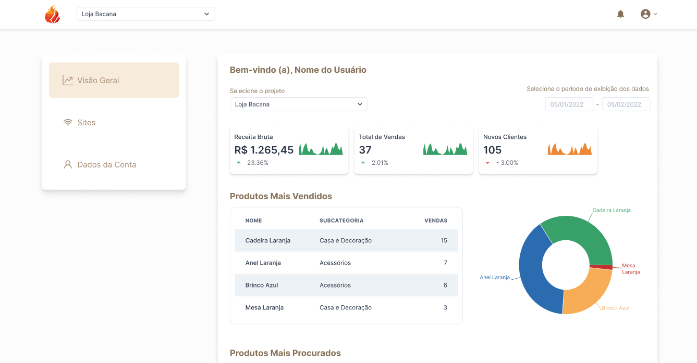

A [Plataforma](https://lojana.net/platform) (ou Portal do Cliente) é o sistema que permite que o cliente gerencie suas lojas virtuais, veja informações sobre suas vendas, informe os dados de sua empresa, etc. Este documento descreve de maneira técnica como a Plataforma funciona.

----

Repositório: https://github.com/firestormapps/platform

----

## Aba Visão Geral

A aba Visão Geral, como o nome sugere, mostra uma visão geral das lojas virtuais do cliente. Nela, o cliente pode ver informações como:

- Quantidades de vendas, por site, no período
- Quantidades de novos usuários no período
- Quantidades de novos pedidos, por site, no período
- Produtos Mais Vendidos no período

Essas informações, são obtidas realizando um chamada GET ao endpoint `/api/dashboard`, do Next.js, que por sua vez, realiza chamadas ao [CMS](/docs/loja_na_net/platform_backend), para obter as informações necessárias.

## Aba Sites

Nesta aba o cliente pode gerenciar suas lojas virtuais. Ele pode:

- Criar novas lojas virtuais
- Editar as informações de uma loja virtual
- Publicar alterações em uma loja virtual

Quando um cliente cria uma loja virtual, são realizadas as seguintes ações:

- As informações do formulário são salvos na collection `projects` do [CMS](/docs/loja_na_net/platform_backend)
- É feita uma chamada ao [Deployer](/docs/loja_na_net/deployer), para que o mesmo crie/edite os arquivos de projeto do site, através da fila de processamento.

## Aba Dados da Conta

Nesta aba o cliente pode editar os dados de sua conta, como:

- Nome e Sobrenome
- E-mail
- Telefone
- CNPJ/CPF

**NOTA**: O nome do negócio (empresa) não é editável por questões de segurança. O nome da empresa é utilizado para criar o Account no CMS e por conta dissos, não pode ser alterado.

